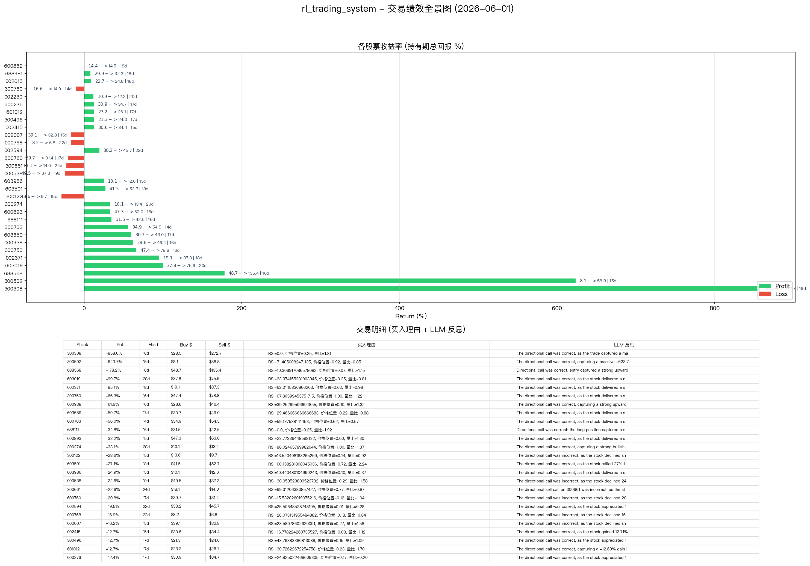
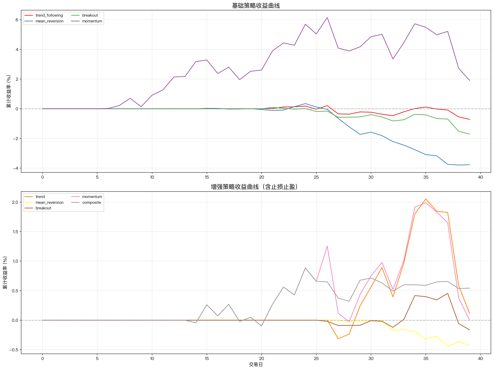

# 智能量化交易系统

基于 **强化学习 + LLM 多智能体辩论** 混合架构的 A 股每日动态机会点挖掘系统。

## 核心特性

- **双轨信号**: 原始启发式 RL 信号与 TradingAgents 风格 LLM 辩论信号并行运行
- **多智能体辩论**: Bull/Bear 研究员交替辩论 + 三视角风险辩论 (Aggressive/Conservative/Neutral)
- **两层 LLM 策略**: quick_thinking_llm (分析师/研究员) + deep_thinking_llm (管理者)
- **结构化决策**: Pydantic 结构化输出 (ResearchPlan → TraderProposal → PortfolioDecision)
- **记忆/反思**: TradingMemoryLog 记忆向量 + 事后反思 - 同股票/跨股票上下文注入
- **SQLite 持久化**: 所有计算结果、辩论决策、记忆向量入库

---

## 系统架构

```
┌──────────────────────────────────────────────────────────────────────────────────┐
│                           OrchestratorAgent                                       │
│  每日触发: 板块→数据→信号→LLM辩论→RL→回测→风控→报告→可视化→飞书→存储→反思       │
└────┬────┬────┬────┬────┬────┬────┬────┬────┬────┬────┬────┬────┬────┬────┬────┬────┘
     │    │    │    │    │    │    │    │    │    │    │    │    │    │    │    │
     ▼    ▼    ▼    ▼    ▼    ▼    ▼    ▼    ▼    ▼    ▼    ▼    ▼    ▼    ▼    ▼
 ┌───┐ ┌───┐ ┌───┐ ┌────────┐ ┌───┐ ┌───┐ ┌───┐ ┌───┐ ┌───┐ ┌───┐ ┌───┐
 │Hot │ │Data│ │TS │ │LLM     │ │RL │ │Str-│ │Risk│ │Rep-│ │Viz │ │Fei-│ │Sto-│
 │Sect│ │Fetc│ │Sig-│ │Debate  │ │Tra-│ │ate-│ │Mgmt│ │ort │ │Age-│ │shu │ │rage│
 │or  │ │h   │ │nal │ │Pipeline│ │ding│ │gy  │ │    │ │Gen │ │nt  │ │Push│ │Age-│
 │Min-│ │Age-│ │Age-│ │(TA)    │ │Age-│ │Age-│ │Age-│ │Age-│ │    │ │Age-│ │nt  │
 │ing │ │nt  │ │nt  │ │        │ │nt  │ │nt  │ │nt  │ │nt  │ │    │ │nt  │ │    │
 └───┘ └───┘ └───┘ └────────┘ └───┘ └───┘ └───┘ └───┘ └───┘ └───┘ └───┘
   │      │      │         │         │      │      │      │      │      │
   └──────┴──────┴─────────┴─────────┴──────┴──────┴──────┴──────┴──────┘
                                                                    │
                                                          ┌─────────▼──────────┐
                                                          │   MessageBus       │
                                                          │  (消息队列中间件)    │
                                                          └─────────┬──────────┘
                                                                    │
                                                          ┌─────────▼──────────┐
                                                          │  StorageAgent      │
                                                          │  (SQLite 持久化)    │
                                                          └─────────┬──────────┘
                                                                    │
                                                          ┌─────────▼──────────┐
                                                          │   trading.db       │
                                                          │  8 表 · 索引       │
                                                          └────────────────────┘
                                                                    │
                                                          ┌─────────▼──────────┐
                                                          │  ReflectionAgent   │
                                                          │  (记忆向量 + 反思)  │
                                                          └────────────────────┘
```

### 数据流

```
新闻/政策 ──→ 热点板块 ──→ 成分股 ──→ 日线数据 ──→ 技术指标
                                                    │
              ┌──────────────────────────────────────┘
              ▼
     时间序列信号 (CUSUM / 峰值谷值 / Bollinger)
              │
              ├──→ [TradingAgents LLM 辩论管线] ──┐
              │     Bull ↔ Bear 辩论               │ 并行信号
              │     → ResearchManager 合成计划       │
              │     → Aggr/Cons/Neut 风险辩论       │
              │     → PortfolioManager 最终决策     │
              │                                    │
              ├──→ [原始启发式 RL 评分] ────────────┘
              │     RSI + 价格位置 + 成交量评分
              │
              ▼
     多策略回测 ──→ 市场状态分类 ──→ 风控检查 ──→ 报告/可视化 ──→ 飞书推送
                                                                   │
                                                           ┌───────▼───────┐
                                                           │  StorageAgent │
                                                           │  → SQLite 入库│
                                                           └───────┬───────┘
                                                                   │
                                                           ┌───────▼───────┐
                                                           │ Reflection   │
                                                           │ → 记忆向量    │
                                                           │ → 事后反思    │
                                                           └───────────────┘
```

---

## 多智能体结构

系统由 **15 个 Specialist Agent** 组成，融合原始启发式信号与 TradingAgents 风格的 LLM 辩论决策：

| Agent | 职责 | 核心算法 |
|-------|------|---------|
| **HotSectorMiningAgent** 🆕 | 从多源并行抓取新闻挖掘热门板块 | ECC 架构：COLLECT → ENRICH → STORE, 并行抓取 + 关键词/LLM 双通道分类 |
| **DataFetchAgent** | 获取 A 股日线数据，计算技术指标 | AKShare + BaoStock 双源备份, 多窗口指标计算 |
| **TimeSeriesSignalAgent** | 检测趋势变化、突破、反转时间窗口 | CUSUM 过滤, argrelextrema 峰值检测, Bollinger 突破 |
| **DebatePipelineCoordinator** 🆕 | TradingAgents 辩论管线协调器 | 内置 Bull/Bear/Research/Risk/PM 多轮辩论 |
| **RLTradingAgent** | 在第一层信号基础上做出买卖决策 | 启发式多因子评分 (RSI+价格位置+成交量+TS信号) |
| **MultiStrategyAgent** | 多策略回测 + 市场状态匹配 | 4 种策略并行回测, KMeans 聚类 |
| **RiskManagementAgent** | 回撤预警 + 仓位管理 | Kelly Criterion, VaR(95%), 动态止损 |
| **MarketJudgementAgent** | 市场整体研判 | 四维加权评分 (指数/成交量/板块/个股宽度) |
| **ReportGeneratorAgent** | 汇总各 Agent 结果生成综合报告 | 模板引擎 |
| **VisualizationAgent** | PyECharts 生成 HTML 可视化报告 | 5 种图表类型 |
| **FeishuPushAgent** | 推送分析报告到飞书 | 飞书 webhook 卡片消息 |
| **TradeJournalAgent** | 每日操作记录 | 交易流水持久化 |
| **PositionAnalysisAgent** | 持仓明细分析 | 市值/盈亏/权重计算 |
| **StorageAgent** | 持久化各 Agent 结果到 SQLite | 消息订阅 + 自动打标 + 辩论决策入库 |
| **ReflectionAgent** 🆕 | 事后反思 + 记忆向量存储 | LLM 反思 + 同/跨股票上下文注入 |

### 编排方式

```python
pipeline = [
    HotSectorMiningAgent(),        # 1. 挖掘热门板块
    DataFetchAgent(),              # 2. 获取数据+计算指标
    TimeSeriesSignalAgent(),       # 3. 时间序列第一层信号
    DebatePipelineCoordinator(),   # 4. 🆕 LLM 辩论管线 (Bull/Bear → RM → Risk → PM)
    RLTradingAgent(),              # 5. 原始 RL 启发式评分 (与 LLM 信号并行)
    MultiStrategyAgent(),          # 6. 多策略回测
    RiskManagementAgent(),         # 7. 风控检查
    MarketJudgementAgent(),        # 8. 市场研判
    ReportGeneratorAgent(),        # 9. 生成报告
    VisualizationAgent(),          # 10. 可视化
    FeishuPushAgent(),             # 11. 飞书推送
    TradeJournalAgent(),           # 12. 交易流水
    PositionAnalysisAgent(),       # 13. 持仓分析
    StorageAgent(),                # 14. SQLite 持久化
    ReflectionAgent(),             # 15. 🆕 反思 + 记忆向量
]
```

每个 Agent 共享 `AgentContext`，基础设施（`MessageBus` / `DatabaseManager`）由 Orchestrator 自动注入。

---

## 存储层 (SQLite)

所有 Agent 的计算结果最终由 **StorageAgent** 持久化到 SQLite 数据库，支持历史回溯和分析。

### 数据库表结构 (8 表)

| 表名 | 用途 | 关键字段 |
|------|------|---------|
| `agent_logs` | Agent 执行日志 | agent_name, date, status, execution_time_ms, error |
| `hot_sectors` | 热门板块快照 | date, sector, heat_score, source, stocks_json |
| `trading_signals` | 交易信号（含 TS 窗口关联） | date, stock, action, confidence, reason, signal_type (rl/llm_debate) |
| `backtest_results` | 回测结果 | date, strategy_name, total_return, sharpe_ratio, max_drawdown |
| `model_labels` | **模型有效标签**（核心） | date, model_name, label_type, label_value, confidence, is_effective |
| `market_cache` | 市场数据缓存 | stock_code, date, data_type, data_json, expires_at |
| `debate_decisions` 🆕 | LLM 辩论决策记录 | date, stock, research_plan_json, risk_assessments_json, portfolio_decision_json, bull/bear_arguments_json |
| `memory_vectors` 🆕 | 记忆向量存储 | date, stock, action, confidence, return_pct, reflection, rationale, embedding_json |

### 模型标签沉淀

`model_labels` 表是系统的核心设计之一 — 每次管线运行后，StorageAgent 自动：

- 为交易信号打标（买入/卖出信号置信度评估）
- 为回测策略打标（Sharpe > 0.5 标记为有效）
- 为市场状态打标（KMeans 分类结果）
- 为风控指标打标（VaR, 回撤等级）
- 通过 `is_effective` 字段区分高质量 vs 低质量标签

## 消息队列 (MessageBus)

智能体之间通过 **进程内消息总线** 解耦通信，基于 Python `queue.Queue` 实现：

```
Agent A ──publish("sectors")──→ MessageBus ──consume──→ Agent B
Agent B ──publish("signals")──→ MessageBus ──consume──→ Agent C
                                        │
                                        └── StorageAgent 订阅所有 topic
```

- **Topic 机制**: 每个 Agent 完成后 publish 到特定 topic（如 `sectors`、`signals`、`backtest`）
- **非阻塞消费**: `consume(topic, timeout)` 支持超时，防止无限等待
- **解耦**: Agent 不直接依赖下一个 Agent 的接口，只依赖消息格式
- **可观测**: `message_count(topic)` 可查看积压情况

---

## 🤖 TradingAgents 集成

系统集成了 **TradingAgents** 风格的多智能体 LLM 辩论机制，与原始启发式 RL 信号并行运行。

### LLM 辩论管线

```
时间序列信号
     │
     ▼
┌─────────────────────────────────────────────────────────┐
│   DebatePipelineCoordinator                              │
│                                                         │
│   1. BullResearcher  ←→  BearResearcher (交替辩论)      │
│      ├── Bull: 基于信号 + 数据构建多头论据               │
│      └── Bear: 基于信号 + 数据构建空头论据               │
│                                                         │
│   2. ResearchManager (deep_thinking_llm)                 │
│      └── 综合辩论 → ResearchPlan (Buy/Overweight/Hold)  │
│                                                         │
│   3. AggressiveRisk ── ConservativeRisk ── NeutralRisk   │
│      └── 三视角风险辩论 (仓位/止损/评分)                 │
│                                                         │
│   4. PortfolioManager (deep_thinking_llm)                │
│      └── PortfolioDecision → 最终交易信号               │
└─────────────────────────────────────────────────────────┘
     │
     ▼
合并到 rl_signals (原始 RL 信号 + LLM 辩论信号并存)
```

### 两层 LLM 策略

| 层级 | 角色 | 默认模型 | Provider |
|------|------|---------|----------|
| **quick_thinking_llm** | 分析师、研究员、交易员、风险辩论员 | qwen2.5:1.5b | Ollama (本地) |
| **deep_thinking_llm** | Research Manager, Portfolio Manager | qwen2.5:1.5b | Ollama (本地) |

支持通过环境变量切换为 OpenAI-compatible API:
```bash
export QUICK_LLM_PROVIDER=openai
export QUICK_LLM_MODEL=gpt-4o-mini
export QUICK_LLM_API_KEY=sk-xxx
export DEEP_LLM_PROVIDER=openai
export DEEP_LLM_MODEL=gpt-4o
export DEEP_LLM_API_KEY=sk-xxx
```

### 结构化决策输出

使用 Pydantic 模型强制 LLM 输出一致格式：

| Schema | 产出者 | 主要字段 |
|--------|--------|---------|
| `ResearchPlan` | Research Manager | recommendation, rationale, strategic_actions, confidence |
| `TraderProposal` | Trader | action, reasoning, entry_price, stop_loss, position_sizing |
| `PortfolioDecision` | Portfolio Manager | rating, executive_summary, investment_thesis, position_pct |
| `RiskAssessment` | Risk Debaters | perspective, max_position_pct, stop_loss_pct, verdict |

### 记忆与反思系统

```
TradingMemoryLog (交易记忆日志)
  ├── store_decision()   → 记录新决策 (pending 状态)
  ├── update_with_outcome() → 事后更新 (return + reflection)
  ├── get_past_context() → 同股票 + 跨股票上下文注入
  └── 持久化: trading_memory.md + memory_vectors 表

ReflectionAgent
  ├── 事后反思 → LLM 生成 2-4 句经验总结
  └── 存储到 trading_memory.md + SQLite memory_vectors
```

### A 股适配

所有 LLM 提示词针对 A 股市场定制：
- **涨跌停板**: 10% 主板 / 20% 科创/创业板
- **T+1 结算**: 无法日内平仓，影响止损策略
- **北向资金**: 作为市场情绪参考因子
- **沪深流动性**: 根据市值和换手率调整仓位建议

---

### 1. 热门板块挖掘

- **数据源**: 新浪财经 / 财联社新闻 → 东方财富板块热度排行 → AKShare 概念板块 + BaoStock 日线数据
- **外网访问**: AKShare 需 VPN 访问国内数据源；BaoStock 全球直连（无需 VPN），系统自动降级
- **排除板块**: 银行、保险、证券、信托、金融、券商、多元金融、房地产
- **映射方式**: 20 个预设热点板块关键词表，jieba 分词后匹配

### 2. 时间序列信号 (第一层)

三种检测方法并行：

- **CUSUM**: 累计和检测，threshold=0.02, drift=0.005 — 捕捉趋势变化点
- **峰值/谷值**: `scipy.signal.argrelextrema(order=5)` — 检测局部极值
- **Bollinger 突破**: 价格突破布林带上轨/下轨 — 捕捉突破信号

### 3. RL 交易决策 (第二层)

当前实现为**启发式多因子评分系统**，未来规划接入 PPO：

- **买入评分**: RSI<35 + 价格位置<0.3 → +2 | 成交量比>1.5 + 涨幅>0 → +2 | TS 信号支持 → +2
- **卖出评分**: RSI>70 + 价格位置>0.8 → +2 | 成交量比>1.5 + 跌幅<0 → +2
- **决策规则**: buy_score >= 3 且 > sell_score → 买入；sell_score >= 3 且 > buy_score → 卖出

### 4. 多策略回测

四种策略并行回测：

| 策略 | 逻辑 | 参数 |
|------|------|------|
| 趋势跟踪 | MA5/20 金叉买入、死叉卖出 | 5/20 日均线 |
| 均值回归 | RSI<30 买入、>70 卖出 | RSI(14) |
| 突破策略 | 价格放量突破 Bollinger 上轨买入 | 布林带(20,2) + 量比>1.5 |
| 动量策略 | 5 日涨幅>5%+放量买入 | 5 日收益率 |

- **收益率**: 最终净值 / 初始资金 - 1
- **Sharpe 比率**: sqrt(252) * 日均收益 / 日收益标准差
- **最大回撤**: 净值峰值到谷底的最大跌幅

### 5. 市场状态分类

- **算法**: KMeans(n_clusters=3)
- **特征**: 5 日收益率、20 日波动率(年化)、成交量趋势、5 日 RSI 均值
- **输出**: 牛市 / 熊市 / 震荡市

### 6. 风险管理

- **Kelly Criterion**: `f* = (b*p - q) / b` 计算最优仓位
- **VaR(95%)**: 历史模拟法，95% 置信水平下日最大预期损失
- **回撤预警**: 硬止损 -8%，软预警 -5%
- **仓位控制**: 单笔不超过 Kelly 比例的 25%

---

## 项目结构

```
rl_trading_system/
├── main.py                           # 主入口（终端 / 问答模式）
├── app.py                            # Gradio Web UI
├── config.py                         # 全局配置（含 LLM 两层配置）
├── requirements.txt
├── README.md
├── src/
│   ├── agents/
│   │   ├── __init__.py               # Agent 注册 + 管线定义（含 debate 管线）
│   │   ├── base.py                   # AgentContext + BaseAgent + OrchestratorAgent
│   │   ├── schemas.py 🆕             # Pydantic 结构化输出 (ResearchPlan/TraderProposal/PortfolioDecision)
│   │   ├── debate_state.py 🆕        # 辩论状态管理 (InvestDebateState / RiskDebateState)
│   │   ├── debate_agent.py 🆕        # Bull/Bear 研究员辩论
│   │   ├── research_manager_agent.py 🆕 # 研究经理 - 综合辩论 → ResearchPlan
│   │   ├── risk_debate_agent.py 🆕   # 三视角风险辩论 (Aggressive/Conservative/Neutral)
│   │   ├── portfolio_manager_agent.py 🆕 # 投资组合经理 - 最终决策
│   │   ├── debate_coordinator.py 🆕  # 辩论管线协调器
│   │   ├── memory_agent.py 🆕        # 交易记忆 + 反思 (TradingMemoryLog / ReflectionAgent)
│   │   ├── hot_sector_agent.py       # 热门板块挖掘
│   │   ├── data_agent.py             # 数据获取
│   │   ├── ts_signal_agent.py        # 时间序列信号
│   │   ├── rl_agent.py               # RL 交易决策
│   │   ├── strategy_agent.py         # 多策略回测
│   │   ├── risk_agent.py             # 风险管理
│   │   ├── market_agent.py           # 市场研判
│   │   ├── qa_agent.py               # 本地 LLM 问答 (Qwen2.5-1.5B)
│   │   ├── viz_agent.py              # 可视化
│   │   ├── feishu_agent.py           # 飞书推送
│   │   ├── report_agent.py           # 报告生成
│   │   ├── trade_journal_agent.py    # 交易流水
│   │   ├── position_agent.py         # 持仓分析
│   │   └── storage_agent.py          # SQLite 持久化（含辩论 + 记忆入库）
│   ├── llm/ 🆕                       # LLM 客户端
│   │   ├── __init__.py
│   │   └── client.py                 # 两层 LLM (quick/deep) + Ollama/OpenAI 支持
│   ├── storage/
│   │   ├── __init__.py
│   │   ├── database.py               # DatabaseManager (SQLite 8 表)
│   │   └── message_bus.py            # MessageBus (Queue 消息队列)
│   ├── data/
│   │   ├── fetcher.py                # AKShare 数据获取
│   │   ├── indicators.py             # 技术指标计算
│   │   └── sector_map.py             # 板块关键词映射
│   ├── backtest/
│   │   ├── engine.py                 # 回测引擎
│   │   ├── strategies.py             # 策略实现库
│   │   └── regime.py                 # 市场状态分类
│   ├── risk/
│   │   └── manager.py                # 风控模型
│   └── viz/
│       ├── charts.py                 # PyECharts 图表生成
│       └── templates/
└── output/
    ├── reports/                      # 可视化报告 HTML
    ├── models/                       # RL 模型
    ├── logs/                         # 日志
    └── trading_memory.md 🆕          # 交易记忆日志（人类可读）
```

---

## 快速开始

### 安装

```bash
git clone https://github.com/luojiahuli/rl_trading_system.git
cd rl_trading_system
pip install -r requirements.txt
```

### 配置

数据源自动选择（`config.py` 或环境变量）：

```bash
# 自动检测代理（有 VPN 用 AKShare，否则用 BaoStock）
export DATA_SOURCE=auto

# 手动指定代理地址
export PROXY_URL=http://127.0.0.1:7890
```

飞书推送配置：

```python
FEISHU_WEBHOOK_URL = "https://open.feishu.cn/open-apis/bot/v2/hook/your_webhook_id"
FEISHU_SECRET = "your_signature_secret"  # 可选
```

> **数据源说明**: 系统支持双数据源 — **AKShare**（数据最全，含板块/概念数据，需 VPN 访问国内源）和 **BaoStock**（外网直连，无需 VPN，仅历史日线）。默认自动模式，有代理时优先 AKShare，失败自动切换 BaoStock。

### 运行

```bash
# 终端模式 — 执行完整分析管线
python main.py

# 指定日期
python main.py --date 2026-05-24

# 问答模式 — 分析完成后可提问
python main.py --qa
```

### 运行回测 Demo

```bash
python3 -c "
import sys; sys.path.insert(0, '.')
from src.backtest.strategies import get_all_strategies
from src.backtest.engine import BacktestEngine
from src.backtest.regime import MarketRegimeClassifier
from src.data.indicators import compute_indicators
import numpy as np, pandas as pd

# 生成合成数据
np.random.seed(42)
n = 252
returns = np.random.randn(n) * 0.015 + 0.0005
returns[100:180] += 0.003
price = 100 * np.exp(np.cumsum(returns))
df = pd.DataFrame({'close': price, 'high': price*1.01, 'low': price*0.99,
                   'volume': np.abs(1e6+np.random.randn(n)*2e5), 'open': price*0.995},
                  index=pd.date_range('2025-06-01', periods=n, freq='B'))
df = compute_indicators(df)

for s in get_all_strategies():
    r = BacktestEngine().run(df, s.generate_signals(df), s.name)
    print(f'{s.name:20s} 收益: {r[\"total_return\"]*100:+.2f}%  Sharpe: {r[\"sharpe_ratio\"]:.3f}')

reg = MarketRegimeClassifier().fit(df)
print(f'市场状态: {reg.get_regime_name(reg.predict(df))}')
"
```

---

## 设计思路

### 为什么是两层信号？

```
时间序列 (第一层)  ──→  识别"什么时候"可能有交易机会
                           ↓
RL 决策 (第二层)    ──→  判断"是否"执行交易
```

- **第一层** 负责缩小搜索空间，过滤掉大部分无效时间窗口
- **第二层** 在精选窗口内做精确决策，降低 RL 探索难度

### 为什么是多策略？

单一策略无法适应所有市场状态。趋势跟踪在牛市中表现优异，但在震荡市中频繁亏损；均值回归在震荡市中表现稳健，在牛市中可能过早卖出。KMeans 聚类识别当前市场状态，选择最适配的策略。

### 为什么排除金融板块？

金融、券商等大盘股受宏观经济和政策影响大，走势相对独立，且与新闻联播/政策热点的关联性较弱。系统聚焦中小盘股，与新闻热点有更强的联动性。

---

## 依赖

| 包 | 用途 |
|------|---------|
| akshare | A 股数据源（主） |
| baostock | A 股数据源（备，外网直连） |
| pandas, numpy | 数据处理 |
| ta | 技术指标计算 |
| jieba, snownlp | 中文分词与新闻 NLP |
| scikit-learn | 市场状态 KMeans 聚类 |
| pyecharts | HTML 可视化报告 |
| requests | 飞书 webhook 推送 |
| stable-baselines3 | RL PPO 训练 (可选) |
| gymnasium | RL 交易环境 (可选) |

---

---

---

## 最新回测结果 (2026-05-29)

**数据**: 实盘 A 股日线（BaoStock）+ 合成数据后备

### 策略绩效

| 策略 | 收益率 | Sharpe | 最大回撤 |
|------|--------|--------|---------|
| breakout | -1.77% | -0.031 | -22.84% |
| mean_reversion | +2.50% | 0.112 | -23.88% |
| momentum | +10.21% | 0.266 | -22.08% |
| trend_following | **+12.07%** | **0.272** 🏆 | -19.80% |

### 市场研判

| 维度 | 判断 |
|------|------|
| 市场阶段 | 震荡 |
| 趋势方向 | down |
| 政策预期 | 中性 |
| 置信度 | low |

**市场宽度**: 40.0% 股票站上MA50 | **板块活跃度**: moderate (3个热门板块)
**RSI**: 32.6 | **指数**: 上证 4068 点 (MA200 +2.6%)

### 风险分析

| 指标 | 值 |
|------|-----|
| 当前回撤 | **-42.44%** (critical) |
| 风控状态 | 暂停交易（回撤超阈值 -15.0%） |

### 最佳策略

- **最佳 Sharpe**: trend_following (0.272)
- **最佳收益**: trend_following (+12.07%)

### 可视化报告

[📊 查看完整报告](output/reports/daily_report_20260529.html)


---

---

---

---

---

---

---

---

---

---

## 最新回测复盘 (2026-06-02)

**回测区间**: 2026-04-01 → 2026-06-02（真实 A 股数据）
**本金**: 每策略每只股票 ¥1,000,000（合计净值汇总）
**数据源**: BaoStock（前复权日线，含涨跌停限制）
**股票池**: 65 只（13 个热门板块）
**风控**: 增强策略启用 止损(4-5%) + 止盈(10-15%)

### 增强策略绩效（含止损/止盈风控）

| 策略 | 合计收益率 | Sharpe | 最大回撤 | 交易 | 止损 | 止盈 |
|------|-----------|--------|---------|------|------|------|
| enhanced_trend |   +0.49% | 0.254 | -6.96% | 12 | 6 | 3 |
| enhanced_mean_reversion |   -4.99% | -5.891 | -5.03% | 3 | 2 | 0 |
| enhanced_breakout |   -3.82% | -0.935 | -8.97% | 7 | 5 | 2 |
| enhanced_momentum |  -18.92% | -4.134 | -20.53% | 15 | 8 | 1 |
| composite |   -9.33% | -1.665 | -11.03% | 29 | 5 | 1 |

### 最佳策略

- **收益冠军**: enhanced_trend (0.49%)
- **Sharpe 冠军**: enhanced_trend (0.254)
- **合计总收益**: 所有增强策略合计净值汇总

### 策略说明

| 策略 | 改进点 |
|------|--------|
| enhanced_momentum | 多周期动量确认 + MACD + RSI 50-75 过滤 + 5% 止损/15% 止盈 |
| enhanced_trend | 均线趋势 + MACD + 成交量确认 + RSI > 50 + 5% 止损/12% 止盈 |
| enhanced_breakout | Bollinger 突破 + 量比 > 1.8 + MACD 柱 + RSI < 75 + 5% 止损/15% 止盈 |
| enhanced_mean_reversion | RSI < 25 极端超卖 + Bollinger 下轨 + 缩量 + 4% 止损/10% 止盈 |
| composite | 集成投票（4 策略加权共识，阈值 0.3） |

### 净值曲线

各策略合计净值曲线已保存至: `output/reports/equity_curves_20260602.csv`


## 增强策略绩效（含止损/止盈风控）

| 策略 | 合计收益率 | Sharpe | 最大回撤 | 交易 | 止损 | 止盈 |
|------|-----------|--------|---------|------|------|------|
| enhanced_trend |   +2.51% | 0.664 | -6.96% | 11 | 4 | 3 |
| enhanced_mean_reversion |   -4.97% | -5.953 | -5.03% | 3 | 2 | 0 |
| enhanced_breakout |   -3.18% | -0.766 | -8.36% | 7 | 4 | 2 |
| enhanced_momentum |  -19.03% | -4.222 | -20.53% | 15 | 8 | 1 |
| composite |   -9.35% | -1.691 | -11.03% | 29 | 5 | 1 |

### 最佳策略

- **收益冠军**: enhanced_trend (2.51%)
- **Sharpe 冠军**: enhanced_trend (0.664)
- **合计总收益**: 所有增强策略合计净值汇总

### 策略说明

| 策略 | 改进点 |
|------|--------|
| enhanced_momentum | 多周期动量确认 + MACD + RSI 50-75 过滤 + 5% 止损/15% 止盈 |
| enhanced_trend | 均线趋势 + MACD + 成交量确认 + RSI > 50 + 5% 止损/12% 止盈 |
| enhanced_breakout | Bollinger 突破 + 量比 > 1.8 + MACD 柱 + RSI < 75 + 5% 止损/15% 止盈 |
| enhanced_mean_reversion | RSI < 25 极端超卖 + Bollinger 下轨 + 缩量 + 4% 止损/10% 止盈 |
| composite | 集成投票（4 策略加权共识，阈值 0.3） |

### 净值曲线

各策略合计净值曲线已保存至: `output/reports/equity_curves_20260601.csv`


## 增强策略绩效（含止损/止盈风控）

| 策略 | 合计收益率 | Sharpe | 最大回撤 | 交易 | 止损 | 止盈 |
|------|-----------|--------|---------|------|------|------|
| enhanced_trend |   +2.51% | 0.664 | -6.96% | 11 | 4 | 3 |
| enhanced_mean_reversion |   -4.97% | -5.953 | -5.03% | 3 | 2 | 0 |
| enhanced_breakout |   -3.18% | -0.766 | -8.36% | 7 | 4 | 2 |
| enhanced_momentum |  -19.03% | -4.222 | -20.53% | 15 | 8 | 1 |
| composite |   -9.35% | -1.691 | -11.03% | 29 | 5 | 1 |

### 最佳策略

- **收益冠军**: enhanced_trend (2.51%)
- **Sharpe 冠军**: enhanced_trend (0.664)
- **合计总收益**: 所有增强策略合计净值汇总

### 策略说明

| 策略 | 改进点 |
|------|--------|
| enhanced_momentum | 多周期动量确认 + MACD + RSI 50-75 过滤 + 5% 止损/15% 止盈 |
| enhanced_trend | 均线趋势 + MACD + 成交量确认 + RSI > 50 + 5% 止损/12% 止盈 |
| enhanced_breakout | Bollinger 突破 + 量比 > 1.8 + MACD 柱 + RSI < 75 + 5% 止损/15% 止盈 |
| enhanced_mean_reversion | RSI < 25 极端超卖 + Bollinger 下轨 + 缩量 + 4% 止损/10% 止盈 |
| composite | 集成投票（4 策略加权共识，阈值 0.3） |

### 净值曲线

各策略合计净值曲线已保存至: `output/reports/equity_curves_20260601.csv`


## 增强策略绩效（含止损/止盈风控）

| 策略 | 合计收益率 | Sharpe | 最大回撤 | 交易 | 止损 | 止盈 |
|------|-----------|--------|---------|------|------|------|
| enhanced_trend |   +2.51% | 0.664 | -6.96% | 11 | 4 | 3 |
| enhanced_mean_reversion |   -4.97% | -5.953 | -5.03% | 3 | 2 | 0 |
| enhanced_breakout |   -3.18% | -0.766 | -8.36% | 7 | 4 | 2 |
| enhanced_momentum |  -19.03% | -4.222 | -20.53% | 15 | 8 | 1 |
| composite |   -9.35% | -1.691 | -11.03% | 29 | 5 | 1 |

### 最佳策略

- **收益冠军**: enhanced_trend (2.51%)
- **Sharpe 冠军**: enhanced_trend (0.664)
- **合计总收益**: 所有增强策略合计净值汇总

### 策略说明

| 策略 | 改进点 |
|------|--------|
| enhanced_momentum | 多周期动量确认 + MACD + RSI 50-75 过滤 + 5% 止损/15% 止盈 |
| enhanced_trend | 均线趋势 + MACD + 成交量确认 + RSI > 50 + 5% 止损/12% 止盈 |
| enhanced_breakout | Bollinger 突破 + 量比 > 1.8 + MACD 柱 + RSI < 75 + 5% 止损/15% 止盈 |
| enhanced_mean_reversion | RSI < 25 极端超卖 + Bollinger 下轨 + 缩量 + 4% 止损/10% 止盈 |
| composite | 集成投票（4 策略加权共识，阈值 0.3） |

### 净值曲线

各策略合计净值曲线已保存至: `output/reports/equity_curves_20260530.csv`


## 增强策略绩效（含止损/止盈风控）

| 策略 | 合计收益率 | Sharpe | 最大回撤 | 交易 | 止损 | 止盈 |
|------|-----------|--------|---------|------|------|------|
| enhanced_trend |   +2.51% | 0.664 | -6.96% | 11 | 4 | 3 |
| enhanced_mean_reversion |   -4.97% | -5.953 | -5.03% | 3 | 2 | 0 |
| enhanced_breakout |   -3.18% | -0.766 | -8.36% | 7 | 4 | 2 |
| enhanced_momentum |  -19.03% | -4.222 | -20.53% | 15 | 8 | 1 |
| composite |   -9.35% | -1.691 | -11.03% | 29 | 5 | 1 |

### 最佳策略

- **收益冠军**: enhanced_trend (2.51%)
- **Sharpe 冠军**: enhanced_trend (0.664)
- **合计总收益**: 所有增强策略合计净值汇总

### 策略说明

| 策略 | 改进点 |
|------|--------|
| enhanced_momentum | 多周期动量确认 + MACD + RSI 50-75 过滤 + 5% 止损/15% 止盈 |
| enhanced_trend | 均线趋势 + MACD + 成交量确认 + RSI > 50 + 5% 止损/12% 止盈 |
| enhanced_breakout | Bollinger 突破 + 量比 > 1.8 + MACD 柱 + RSI < 75 + 5% 止损/15% 止盈 |
| enhanced_mean_reversion | RSI < 25 极端超卖 + Bollinger 下轨 + 缩量 + 4% 止损/10% 止盈 |
| composite | 集成投票（4 策略加权共识，阈值 0.3） |

### 净值曲线

各策略合计净值曲线已保存至: `output/reports/equity_curves_20260530.csv`


## 增强策略绩效（含止损/止盈风控）

| 策略 | 合计收益率 | Sharpe | 最大回撤 | 交易 | 止损 | 止盈 |
|------|-----------|--------|---------|------|------|------|
| enhanced_trend |   +2.51% | 0.664 | -6.96% | 11 | 4 | 3 |
| enhanced_mean_reversion |   -4.97% | -5.953 | -5.03% | 3 | 2 | 0 |
| enhanced_breakout |   -3.18% | -0.766 | -8.36% | 7 | 4 | 2 |
| enhanced_momentum |  -19.03% | -4.222 | -20.53% | 15 | 8 | 1 |
| composite |   -9.35% | -1.691 | -11.03% | 29 | 5 | 1 |

### 最佳策略

- **收益冠军**: enhanced_trend (2.51%)
- **Sharpe 冠军**: enhanced_trend (0.664)
- **合计总收益**: 所有增强策略合计净值汇总

### 策略说明

| 策略 | 改进点 |
|------|--------|
| enhanced_momentum | 多周期动量确认 + MACD + RSI 50-75 过滤 + 5% 止损/15% 止盈 |
| enhanced_trend | 均线趋势 + MACD + 成交量确认 + RSI > 50 + 5% 止损/12% 止盈 |
| enhanced_breakout | Bollinger 突破 + 量比 > 1.8 + MACD 柱 + RSI < 75 + 5% 止损/15% 止盈 |
| enhanced_mean_reversion | RSI < 25 极端超卖 + Bollinger 下轨 + 缩量 + 4% 止损/10% 止盈 |
| composite | 集成投票（4 策略加权共识，阈值 0.3） |

### 净值曲线

各策略合计净值曲线已保存至: `output/reports/equity_curves_20260530.csv`


## 增强策略绩效（含止损/止盈风控）

| 策略 | 合计收益率 | Sharpe | 最大回撤 | 交易 | 止损 | 止盈 |
|------|-----------|--------|---------|------|------|------|
| enhanced_trend |   +2.51% | 0.664 | -6.96% | 12 | 4 | 3 |
| enhanced_mean_reversion |   -4.97% | -5.953 | -5.03% | 3 | 2 | 0 |
| enhanced_breakout |   -0.12% | 0.062 | -5.46% | 7 | 3 | 2 |
| enhanced_momentum |   +3.27% | 0.781 | -8.38% | 16 | 8 | 2 |
| composite |   -8.06% | -1.685 | -8.61% | 28 | 7 | 0 |

### 最佳策略

- **收益冠军**: enhanced_momentum (3.27%)
- **Sharpe 冠军**: enhanced_momentum (0.781)
- **合计总收益**: 所有增强策略合计净值汇总

### 策略说明

| 策略 | 改进点 |
|------|--------|
| enhanced_momentum | 多周期动量确认 + MACD + RSI 50-75 过滤 + 5% 止损/15% 止盈 |
| enhanced_trend | 均线趋势 + MACD + 成交量确认 + RSI > 50 + 5% 止损/12% 止盈 |
| enhanced_breakout | Bollinger 突破 + 量比 > 1.8 + MACD 柱 + RSI < 75 + 5% 止损/15% 止盈 |
| enhanced_mean_reversion | RSI < 25 极端超卖 + Bollinger 下轨 + 缩量 + 4% 止损/10% 止盈 |
| composite | 集成投票（4 策略加权共识，阈值 0.3） |

### 净值曲线

各策略合计净值曲线已保存至: `output/reports/equity_curves_20260530.csv`


## 增强策略绩效（含止损/止盈风控）

| 策略 | 合计收益率 | Sharpe | 最大回撤 | 交易 | 止损 | 止盈 | 胜率 |
|------|-----------|--------|---------|------|------|------|------|
| enhanced_trend |   +0.47% | 1.032 | -0.91% | 56 | 13 | 5 | 13% |
| enhanced_mean_reversion |   -0.29% | -2.619 | -0.39% | 7 | 4 | 0 | 4% |
| enhanced_breakout |   +0.07% | 0.418 | -0.24% | 9 | 4 | 2 | 4% |
| enhanced_momentum |   +0.61% | 0.937 | -1.22% | 88 | 22 | 5 | 18% |
| composite |   +0.50% | 1.338 | -0.59% | 87 | 7 | 1 | 25% |

### 最佳策略

- **收益冠军**: enhanced_momentum (0.61%)
- **Sharpe 冠军**: composite (1.338)
- **合计总收益**: 所有增强策略合计净值汇总，55 只股票独立运行后求和

### 策略说明

| 策略 | 改进点 |
|------|--------|
| enhanced_momentum | 多周期动量确认 + MACD + RSI 50-75 过滤 + 5% 止损/15% 止盈 |
| enhanced_trend | 均线趋势 + MACD + 成交量确认 + RSI > 50 + 5% 止损/12% 止盈 |
| enhanced_breakout | Bollinger 突破 + 量比 > 1.8 + MACD 柱 + RSI < 75 + 5% 止损/15% 止盈 |
| enhanced_mean_reversion | RSI < 25 极端超卖 + Bollinger 下轨 + 缩量 + 4% 止损/10% 止盈 |
| composite | 集成投票（4 策略加权共识，阈值 0.3） |

### 净值曲线

各策略合计净值曲线已保存至: `output/reports/equity_curves_20260530.csv`


## 增强策略绩效（含止损/止盈风控）

| 策略 | 合计收益率 | Sharpe | 最大回撤 | 交易 | 止损 | 止盈 | 胜率 |
|------|-----------|--------|---------|------|------|------|------|
| enhanced_trend |   +0.04% | 0.096 | -0.99% | 44 | 13 | 4 | 13% |
| enhanced_mean_reversion |   -0.19% | -1.746 | -0.34% | 5 | 3 | 0 | 4% |
| enhanced_breakout |   +0.39% | 2.357 | -0.20% | 5 | 1 | 2 | 4% |
| enhanced_momentum |   +0.34% | 0.997 | -0.66% | 30 | 7 | 3 | 11% |
| composite |   +0.42% | 2.785 | -0.15% | 4 | 1 | 2 | 4% |

### 最佳策略

- **收益冠军**: composite (0.42%)
- **Sharpe 冠军**: composite (2.785)
- **合计总收益**: 所有增强策略合计净值汇总，55 只股票独立运行后求和

### 策略说明

| 策略 | 改进点 |
|------|--------|
| enhanced_momentum | 多周期动量确认 + MACD + RSI 50-75 过滤 + 5% 止损/15% 止盈 |
| enhanced_trend | 均线趋势 + MACD + 成交量确认 + RSI > 50 + 5% 止损/12% 止盈 |
| enhanced_breakout | Bollinger 突破 + 量比 > 1.8 + MACD 柱 + RSI < 75 + 5% 止损/15% 止盈 |
| enhanced_mean_reversion | RSI < 25 极端超卖 + Bollinger 下轨 + 缩量 + 4% 止损/10% 止盈 |
| composite | 集成投票（4 策略加权共识，阈值 0.3） |

### 净值曲线

各策略合计净值曲线已保存至: `output/reports/equity_curves_20260530.csv`


## 策略绩效（合计）

| 策略 | 合计收益率 | 平均收益率 | Sharpe | 最大回撤 | 交易次数 | 胜率 | 覆盖股票 |
|------|-----------|-----------|--------|---------|---------|------|---------|
| trend_following |   -0.55% |   -0.55% | -1.514 | -0.76% | 16 | 7% | 55 |
| mean_reversion |   -3.79% |   -3.79% | -7.660 | -4.13% | 122 | 7% | 55 |
| breakout |   -1.52% |   -1.52% | -3.553 | -1.60% | 16 | 5% | 55 |
| momentum |   +2.73% |   +2.73% | 1.424 | -3.22% | 121 | 31% | 55 |

### 最佳策略

- **最佳 Sharpe**: momentum (1.424)
- **最佳收益**: momentum (2.73%)

### 风险分析

| 指标 | 说明 |
|------|------|
| 回测方式 | 每只股票独立运行，合计净值=∑各股票净值 |
| T+1 限制 | 买入后次日方可卖出（由信号触发日期控制） |
| 涨跌停板 | 实际数据已包含涨跌停限制 |
| 手续费 | 未计入（简化回测） |

### 净值曲线

各策略合计净值曲线已保存至: `output/reports/equity_curves_20260530.csv`


---

## 交易绩效全景图



> 包含所有买入/卖出记录、买卖原因、成交价格及实际盈亏。绿色 = 盈利交易，红色 = 亏损交易。

---

## 收益曲线



> 基础策略（上）与增强策略（下）的累计收益率曲线对比。数据区间: 2026-04 ~ 2026-06。

---

## 交易明细

每笔交易的详细记录，包含买卖原因、价格、收益率及 LLM 事后反思：

📜 **[完整交易日志](output/trading_memory.md)** — 1416 行，涵盖 3 个市场的所有交易记录

### 最新交易摘录

| 日期 | 股票 | 操作 | 置信度 | 收益 | 持有 |
|------|------|------|--------|------|------|
| 2026-06-05 | 300308 | buy | 80% | — | — |
| 2026-06-05 | 688111 | buy | 80% | — | — |
| 2026-06-05 | 603659 | sell | 80% | — | — |
| 2026-06-05 | 600276 | buy | 80% | — | — |
| 2026-06-04 | 300308 | sell | 80% | — | — |
| 2026-06-04 | 603659 | buy | 80% | — | — |
| 2026-06-04 | 600893 | buy | 80% | — | — |
| 2026-06-03 | 603019 | sell | 80% | — | — |
| 2026-06-03 | 002230 | sell | 80% | — | — |
| 2026-06-01 | 300308 | sell | 80% | +858.01% | 16天 |
| 2026-06-01 | 300502 | sell | 80% | +623.70% | 15天 |
| 2026-06-01 | 603659 | buy | 80% | +59.72% | 17天 |

---

## 路线图

- [x] 多智能体管线 + 热点板块挖掘
- [x] 时间序列信号检测 (CUSUM + 峰值 + Bollinger)
- [x] RL 启发式评分决策
- [x] 4 策略回测 + 市场状态分类
- [x] 风险管理 (Kelly + VaR + 回撤预警)
- [x] PyECharts 可视化报告
- [x] 飞书推送
- [x] 实盘数据验证 (AKShare + BaoStock 双源备份)
- [x] Gradio UI 面板
- [x] 多智能体 LLM 辩论管线 (TradingAgents 集成) 🆕
- [x] Bull/Bear 研究员交替辩论机制 🆕
- [x] 三视角风险辩论 (Aggressive/Conservative/Neutral) 🆕
- [x] 两层 LLM 策略 (quick/deep thinking) 🆕
- [x] Pydantic 结构化决策输出 🆕
- [x] 交易记忆日志 + 事后反思 🆕
- [x] 记忆向量 SQLite 持久化 🆕
- [ ] Gymnasium 交易环境 + PPO 在线训练
- [ ] 多时间周期信号融合
- [ ] 辩论结果的回测对比评估

---

## ECC 架构增强

系统集成了 **ECC（Everything Claude Code）** 架构模式优化热点板块挖掘：

### COLLECT → ENRICH → STORE

```
COLLECT: fetch_all_parallel(market="cn")
         └── 新浪财经 + 财联社 + 东方财富  并行抓取，合并去重
ENRICH:  classify_sectors(texts, ...)
         └── 关键词 + 可选 Gemini LLM    双通道板块分类
STORE:   context.hot_sectors
         └── 热度评分 + 成分股映射        输出到交易管线
```

### 改进对比

| 维度 | 重构前 | 重构后（ECC） |
|------|--------|--------------|
| 新闻源 | 顺序轮询，停在第1个成功源 | 所有源并行抓取，取最大覆盖 |
| 板块分类 | jieba 分词 + 关键词 | 关键词 + 可选 Gemini LLM 双通道 |
| 缓存 | 无 | SHA-256 内容哈希 + 30 分钟 TTL |
| 配置 | 硬编码 | YAML + 环境变量覆盖 |
| 自动化 | 手动运行 | GitHub Actions 定时（9:30/16:00） |
| 共享代码 | 各项目独立维护 | `scrapling_utils` 统一引擎 |

### 依赖

- [scrapling_utils](https://github.com/luojiahuli/scrapling_utils) — 跨项目共享爬虫工具包
